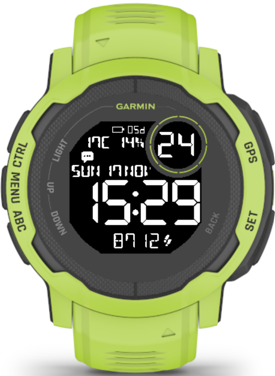

# RetroSimple Watch Face for Garmin Instinct 2

Basic watch face inspired by vintage digital watches, and watch faces like '7 Segments Simple'.

Displayed information, from top to bottom, left to right:
* Battery
* Seconds
* Weather: temperature and chance of precipitation
* Notifications icon
* Date
* Time
* Steps counter

The complications are not configurable outside of watch settings (like temperature units or time format).

Only Instinct 2 family of watches is supported.

The app can now be found in [Garmin Store](https://apps.garmin.com/apps/516e843d-6d26-4f48-9760-3d01989872c6)

## Screenshot

